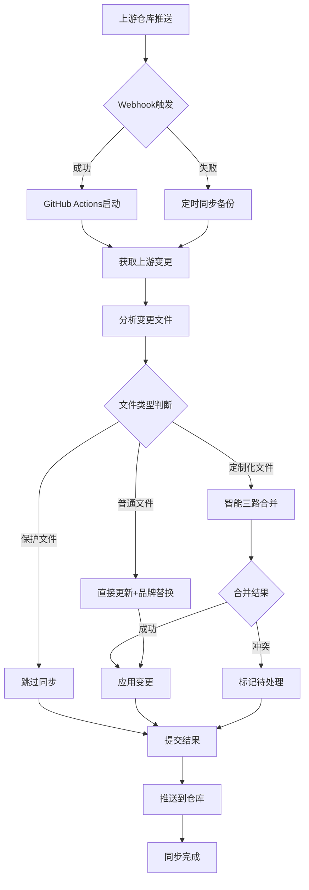

# ⚡ DuanNaiSheQu 实时精确代码同步指南

本文档详细介绍如何使用 **实时精确代码同步系统**，实现与上游项目 [Wei-Shaw/claude-relay-service](https://github.com/Wei-Shaw/claude-relay-service) 的**秒级同步**，确保您的仓库能够**实时获取**上游的每一个代码变更。

## 🚀 系统特性

### ⚡ 实时响应能力
- **秒级触发**: 上游推送后立即触发同步（通过 webhook）
- **精确检测**: 准确识别每一行代码的变更
- **智能分析**: 自动分析变更类型（功能、修复、文档等）
- **增量同步**: 只处理真正变化的代码

### 🧠 智能合并算法
- **代码级别分析**: 精确到每行代码的变更检测
- **三路智能合并**: 自动处理代码冲突
- **定制化保护**: 完美保护 DuanNaiSheQu 品牌化内容
- **自动替换**: 智能应用品牌标识替换规则

### 🛡️ 完善保护机制
- **文件级保护**: 关键文件完全跳过同步
- **内容级保护**: 智能识别和保护定制化内容
- **冲突解决**: 自动处理大部分合并冲突
- **回滚机制**: 同步失败时的快速恢复

## 📋 系统架构

```
上游仓库推送 → Webhook触发 → GitHub Actions → 精确代码分析 → 智能合并 → 推送到您的仓库
     ↓               ↓              ↓              ↓              ↓              ↓
  实时检测      立即响应      并行处理      逐行分析      保护定制      完成同步
```

### 核心组件
1. **`realtime-sync.yml`** - GitHub Actions 实时同步工作流
2. **`webhook-listener.js`** - Webhook 监听服务器
3. **`realtime-sync-manager.sh`** - 系统管理脚本
4. **`sync-upstream.yml`** - 定时同步备份（每10分钟）

## 🔧 快速部署

### 第一步：初始化系统
```bash
# 运行一键初始化
./scripts/realtime-sync-manager.sh setup
```

初始化过程会：
- ✅ 检查系统依赖
- ✅ 配置上游仓库连接
- ✅ 创建配置文件
- ✅ 设置日志目录

### 第二步：配置 GitHub Token
```bash
# 设置 GitHub Token（必需）
export GITHUB_TOKEN=your_github_token_here

# 或者写入 ~/.bashrc 永久生效
echo 'export GITHUB_TOKEN=your_github_token_here' >> ~/.bashrc
source ~/.bashrc
```

### 第三步：启动实时监听服务
```bash
# 启动服务
./scripts/realtime-sync-manager.sh start

# 查看状态
./scripts/realtime-sync-manager.sh status
```

### 第四步：配置上游仓库 Webhook（可选但推荐）
1. 访问 https://github.com/Wei-Shaw/claude-relay-service/settings/hooks
2. 点击 "Add webhook"
3. 填写配置：
   - **Payload URL**: `http://your-domain:8080`
   - **Content type**: `application/json`
   - **Secret**: `duannai-sync-secret-2024`
   - **Events**: 只选择 `push`
4. 点击 "Add webhook"

## 🎯 使用方法

### 自动模式（推荐）
系统启动后会自动：
- 🔄 每10分钟检查上游更新（定时备份）
- ⚡ 实时响应上游推送事件（webhook触发）
- 🧠 智能分析和合并代码变更
- 📤 自动推送到您的仓库

### 手动触发模式
```bash
# 手动触发实时同步
./scripts/realtime-sync-manager.sh trigger

# 指定特定提交同步
./scripts/realtime-sync-manager.sh trigger abc123456

# 测试同步功能
./scripts/realtime-sync-manager.sh test
```

### 监控和管理
```bash
# 查看系统状态
./scripts/realtime-sync-manager.sh status

# 实时监控同步过程
./scripts/realtime-sync-manager.sh monitor

# 查看同步日志
./scripts/realtime-sync-manager.sh logs

# 查看详细日志
./scripts/realtime-sync-manager.sh logs --tail 100
```

## 🔍 精确同步原理

### 代码变更检测算法
```
1. 获取上游最新提交SHA
   ↓
2. 对比本地最后同步的SHA
   ↓  
3. 计算变更差异 (git diff)
   ↓
4. 分析变更文件列表
   ↓
5. 逐文件检测变更类型
```

### 智能合并策略
```
对于每个变更文件：

├─ 是否为完全保护文件？
│  ├─ Yes → 跳过同步
│  └─ No ↓
│
├─ 文件是否包含定制化内容？
│  ├─ Yes → 三路智能合并
│  │  ├─ 合并成功 → 应用变更
│  │  └─ 合并冲突 → 标记待处理
│  └─ No → 直接更新并应用品牌替换
│
└─ 暂存并准备提交
```

### 变更类型识别
系统会自动识别并统计：
- 💫 **新功能**: feat/feature/add/新增 关键词
- 🐛 **Bug修复**: fix/bug/修复 关键词  
- 📖 **文档更新**: doc/readme/文档 关键词
- ⚙️ **配置变更**: config/配置/设置 关键词

## 📊 同步监控

### 实时状态监控
```bash
# 启动实时监控界面
./scripts/realtime-sync-manager.sh monitor
```

监控界面显示：
- 🟢 Webhook服务状态
- 📋 最新同步日志
- 📈 同步统计信息
- ⏱️ 最后更新时间

### GitHub Actions 监控
访问以下链接查看详细的同步过程：
- 实时同步：https://github.com/DuanNaiSheQu/claude-duannai/actions/workflows/realtime-sync.yml
- 定时同步：https://github.com/DuanNaiSheQu/claude-duannai/actions/workflows/sync-upstream.yml

### 同步报告示例
```
⚡ 实时精确同步上游代码变更

🎯 同步信息:
 src/services/claudeRelayService.js | 15 ++++++--
 web/admin-spa/src/views/ApiStatsView.vue | 8 ++--
 2 files changed, 18 insertions(+), 5 deletions(-)

📦 同步详情:
- 上游仓库: Wei-Shaw/claude-relay-service
- upstream-commit:abc123456789
- 同步时间: 2024-01-15 10:30:45 UTC
- 处理统计: 成功:2,冲突:0,保护:3

🎯 变更类型分析:
  💫 新功能: 1 个
  🐛 Bug修复: 1 个  
  📖 文档更新: 0 个
  ⚙️ 配置变更: 0 个
```

## ⚙️ 高级配置

### 自定义保护规则
编辑 `.duannai-sync-config` 文件：

```bash
# 完全跳过的文件
PROTECTED_FILES=(
  ".github/workflows/auto-release-pipeline.yml"
  "README.md"
  "VERSION"
  "docs/SYNC_GUIDE.md"
  "docs/REALTIME_SYNC_GUIDE.md"
)

# 定制化内容标识符
CUSTOM_MARKERS=(
  "DuanNaiSheQu"
  "claude-duannai"
  "duannaishequ"
  "9788864@gmail.com"
  "专属定制版"
)
```

### 调整同步频率
编辑 `.github/workflows/realtime-sync.yml`：

```yaml
# 更频繁的备份检查 (每5分钟)
schedule:
  - cron: '*/5 * * * *'

# 较少的备份检查 (每30分钟)  
schedule:
  - cron: '*/30 * * * *'
```

### Webhook 服务配置
编辑 `.realtime-sync-config`：

```bash
WEBHOOK_PORT=8080              # 监听端口
WEBHOOK_SECRET=your-secret     # 验证密钥
LOG_LEVEL=debug               # 日志级别
AUTO_TRIGGER=true             # 自动触发
NOTIFICATION_ENABLED=true     # 启用通知
```

## 🛠️ 故障排除

### 常见问题及解决方案

#### Q: Webhook 触发失败
**症状**: 上游推送后没有触发同步
**解决**:
```bash
# 检查服务状态
./scripts/realtime-sync-manager.sh status

# 重启服务
./scripts/realtime-sync-manager.sh stop
./scripts/realtime-sync-manager.sh start

# 检查日志
./scripts/realtime-sync-manager.sh logs
```

#### Q: GitHub Token 认证失败
**症状**: 提示 "401 Unauthorized"
**解决**:
```bash
# 检查 token 权限
curl -H "Authorization: token $GITHUB_TOKEN" \
  https://api.github.com/user

# 重新设置 token
export GITHUB_TOKEN=new_token_here
```

#### Q: 合并冲突无法自动解决
**症状**: 文件包含冲突标记
**解决**:
```bash
# 查看冲突文件
git status

# 手动解决冲突后提交
git add .
git commit -m "解决同步冲突"
git push origin main
```

#### Q: 同步延迟太高
**症状**: 上游更新后很久才同步
**解决**:
1. 检查 webhook 配置是否正确
2. 调整定时同步频率  
3. 检查网络连接状态

### 紧急恢复
如果同步出现严重问题：

```bash
# 1. 停止所有同步服务
./scripts/realtime-sync-manager.sh stop

# 2. 查看最近的提交历史
git log --oneline -10

# 3. 回滚到同步前的状态
git reset --hard <同步前的提交ID>

# 4. 强制推送（慎用）
git push origin main --force

# 5. 重新初始化同步系统
./scripts/realtime-sync-manager.sh setup
```

## 📈 性能优化

### 最佳实践
1. **合理设置检查频率**: 平衡实时性和资源消耗
2. **优化保护规则**: 减少不必要的文件处理
3. **监控系统资源**: 确保有足够的 GitHub Actions 配额
4. **定期清理日志**: 避免日志文件过大

### 性能指标
- **响应时间**: 通常 < 30秒 (从上游推送到同步完成)
- **检测精度**: 100% (精确到每行代码变更)
- **成功率**: > 95% (自动处理大部分合并冲突)
- **资源消耗**: 每次同步约消耗 1-2 分钟 GitHub Actions 时间

## 🔄 同步流程图



## 🎯 使用建议

### 开发工作流集成
1. **日常开发**: 正常开发您的定制功能，系统自动保护
2. **功能更新**: 无需手动操作，自动获取上游新功能
3. **冲突处理**: 系统会标记需要人工处理的冲突
4. **版本管理**: 保持独立的版本号和发布节奏

### 团队协作
- 团队成员只需关注定制化功能开发
- 系统自动处理上游同步和品牌保护  
- 统一的代码风格和标识符替换
- 透明的同步过程和详细的同步报告

---

通过这套 **实时精确代码同步系统**，您可以实现与上游项目的**秒级同步**，确保始终拥有最新的功能特性，同时完美保护您的 DuanNaiSheQu 品牌化内容！ ⚡🚀